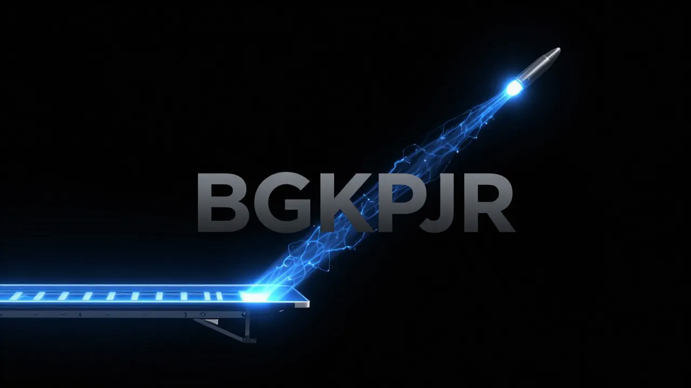

<div align="center"></div>

[](https://github.com/thebardchat/constitution)
[](LICENSE)
[]()
[]()

# BGKPJR Launch Architecture

> **Try Claude free for 2 weeks** — the AI behind this entire ecosystem. [Start your free trial →](https://claude.ai/referral/4fAMYN9Ing)

---


### Brazelton Gryphon Kepler Propulsion Jump Revolution

> *Reducing orbital access costs by 90% through ground-based acceleration and aerodynamic efficiency.*

This project operates under the [ShaneTheBrain Constitution](https://github.com/thebardchat/constitution/blob/main/CONSTITUTION.md).

---

## Infrastructure

All `thebardchat` repositories run on local-first hardware:

| Component | Detail |
|-----------|--------|
| **Compute** | Raspberry Pi 5 (16 GB RAM) |
| **Chassis** | Pironman 5-MAX by Sunfounder |
| **Storage** | 2x WD Blue SN5000 2 TB NVMe — RAID 1 via mdadm |
| **Core path** | `/mnt/shanebrain-raid/shanebrain-core/` |
| **Networking** | Tailscale VPN across all nodes |

> Pi before cloud. Privacy before convenience. — Pillar 4

---

## The Problem

Current space launch systems waste **85-95% of their mass** on propellant to fight Earth's atmosphere and gravity well. The Tsiolkovsky Rocket Equation dictates that for every kilogram of payload, we must lift 20-50 kg of fuel. This fundamental inefficiency keeps space access at **$2,000-10,000 per kilogram**.

## The Solution: BGKPJR Architecture

We propose a three-stage hybrid system that decouples the energy-intensive acceleration phase from the spacecraft:

```
┌─────────────────────────────────────────────────────────────────────┐
│                    BGKPJR LAUNCH SEQUENCE                           │
├─────────────────────────────────────────────────────────────────────┤
│                                                                     │
│  STAGE 1: MAGLEV "JUMP"          STAGE 2: ATMOSPHERIC ASCENT       │
│  ════════════════════════        ═══════════════════════════       │
│                                                                     │
│  ▄▄▄▄▄▄▄▄▄▄▄▄▄▄▄▄▄▄▄▄▄▄▄▄      ●                                   │
│  ████████████████████████       /\        ← Gryphon Wings Deploy   │
│  ████ EVACUATED TUBE ████      /  \                                │
│  ████████████████████████     /    \      Mach 3.5 → Mach 8        │
│  ▀▀▀▀▀▀▀▀▀▀▀▀▀▀▀▀▀▀▀▀▀▀▀▀    /      \     Aerodynamic Lift         │
│         28.7 km              /        \   + Hybrid Propulsion      │
│         15-45° incline      ●──────────●                           │
│         Exit: Mach 3.5-5.0                                         │
│                                                                     │
│  STAGE 3: ORBITAL INSERTION & SOLAR PROPULSION                     │
│  ═════════════════════════════════════════════                     │
│                                                                     │
│              ☀ ─────────────────→ ◇─────────◇                      │
│                                    \  KEPLER /                      │
│                Solar Pressure       \ SAIL  /   1,200 m²           │
│                @ >300km altitude     \    /    CP1 Polyimide       │
│                                       \  /                          │
│                                        \/                           │
│                                                                     │
└─────────────────────────────────────────────────────────────────────┘
```

### Key Innovation: Ground-Based Delta-V

By providing the initial **1,200 m/s (Mach 3.5)** from ground-based superconducting electromagnets rather than onboard propellant, we:

1. **Reduce propellant mass fraction by 40%** (validated by Tsiolkovsky analysis)
2. **Eliminate first-stage recovery complexity** (no landing legs, no return fuel)
3. **Enable aircraft-like reusability** (Gryphon glides back unpowered)

---

## System Components

### 1. Maglev Launch Track

| Parameter | Value | Rationale |
|-----------|-------|-----------|
| **Length** | 28.7 km | Required for < 4g acceleration to Mach 3.5 |
| **Inclination** | 15° - 45° | Variable based on mission profile |
| **Exit Velocity** | Mach 3.5 - 5.0 | 1,190 - 1,700 m/s |
| **Structure** | Evacuated Tube | Partial vacuum (0.1 atm) eliminates drag |
| **Magnets** | Superconducting NbTi | 4.2K operating temp, 8T field strength |

**Critical Physics:**
```
Track Length = v²/(2a)
L = (1190 m/s)² / (2 × 4 × 9.81 m/s²)
L = 18.0 km (minimum at 4g)
L = 28.7 km (with safety margin and curved exit)
```

### 2. Gryphon Spacecraft

Stealth-inspired blended wing body optimized for:
- **Minimum drag** during hypersonic tube exit
- **Maximum lift** during atmospheric climb
- **Thermal survival** at Mach 3.5+ exit conditions

| Parameter | Value |
|-----------|-------|
| **Airframe** | Ti-6Al-4V / Carbon Composite Hybrid |
| **Mass (dry)** | 15,000 kg |
| **Payload** | 5,000 kg to LEO |
| **Wing Area** | 120 m² (deployed) |
| **TPS** | Active Transpiration Cooling (nose cone) |
| **L/D Ratio** | 4.5 (hypersonic) / 8.0 (subsonic return) |

### 3. Kepler Solar Sail Module

**CRITICAL NOTE:** Deployed ONLY at stable orbit (>300 km). Solar sails are **NOT usable for atmospheric ascent** due to negligible thrust-to-weight ratio in gravity well.

| Parameter | Value |
|-----------|-------|
| **Material** | CP1 Polyimide |
| **Thickness** | 2.5 microns |
| **Area** | 1,200 m² (initial) |
| **Thrust** | ~9 mN/m² at 1 AU |
| **Purpose** | Orbit raising, station-keeping, deep space transit |

---

## The Mathematics

### Tsiolkovsky Rocket Equation (Our Baseline)

$$\Delta v = I_{sp} \cdot g_0 \cdot \ln\left(\frac{m_{initial}}{m_{final}}\right)$$

**Without BGKPJR (Traditional):**
- Required Δv to LEO: ~9,400 m/s
- Mass ratio: ~20:1 (95% propellant)

**With BGKPJR:**
- Maglev provides: 1,200 m/s (free)
- Aerodynamic lift assists: ~800 m/s equivalent
- Required onboard Δv: ~7,400 m/s
- Mass ratio: ~12:1 (92% → 75% propellant)

### Compressible Aerodynamics

Standard lift equation with Prandtl-Glauert correction for high subsonic/transonic:

$$C_{L,compressible} = \frac{C_{L,0}}{\sqrt{1 - M^2}}$$

For supersonic (Ackeret linear theory):
$$C_L = \frac{4\alpha}{\sqrt{M^2 - 1}}$$

### Thermal Analysis (Track Exit)

At Mach 3.5 exit into 0.1 atm tube pressure:
```
Stagnation Temperature = T_∞ × (1 + (γ-1)/2 × M²)
T_stag = 288K × (1 + 0.2 × 12.25)
T_stag = 994K (721°C)
```
**Conclusion:** Manageable with titanium leading edges + transpiration cooling.

---

## Repository Structure

```
BGKPJR-Core-Simulations/
├── README.md                    # You are here
├── docs/
│   ├── aerodynamics/            # Lift, drag, compressibility theory
│   ├── propulsion/              # Rocket equations, hybrid systems
│   ├── flight_dynamics/         # Stability, control, trajectory
│   ├── thermal/                 # Heat management, TPS design
│   ├── gnc/                     # Guidance, Navigation, Control
│   └── system_specs/            # Gryphon, Kepler, Track specifications
├── simulation/
│   ├── src/                     # Python physics engine
│   ├── notebooks/               # Jupyter analysis notebooks
│   ├── tests/                   # Unit tests for physics validation
│   └── matlab/                  # MATLAB/Simulink models
├── control_systems/
│   ├── lqr/                     # Linear Quadratic Regulator (atmo phase)
│   ├── mpc/                     # Model Predictive Control (maglev)
│   └── stabilization/           # Attitude control algorithms
├── design/
│   ├── airfoils/                # .dat files for wing profiles
│   ├── geometry/                # OpenVSP/FreeCAD models
│   └── cad/                     # Detailed CAD exports
├── data/
│   ├── lift_drag_polars/        # Aerodynamic coefficient data
│   ├── trajectory_logs/         # Simulation output files
│   ├── monte_carlo/             # Statistical analysis results
│   └── thermal_analysis/        # Temperature distribution data
├── roadmap/                     # 12-month verification plan
└── patents/                     # IP documentation
```

---

## 12-Month Virtual Verification Plan

| Phase | Months | Focus | Deliverables |
|-------|--------|-------|--------------|
| **I** | 1-3 | Mathematical Validation | Trajectory model, Monte Carlo (10k runs), Economic ROI |
| **II** | 4-6 | Aerodynamics & Thermal | Gryphon CFD, Max-Q analysis, TPS design |
| **III** | 7-9 | GNC Development | MPC (maglev), LQR (atmospheric), Solar sail dynamics |
| **IV** | 10-12 | Iron Bird Integration | UE5 visualization, Disaster testing, Investor presentation |

See [roadmap/](roadmap/) for detailed milestone breakdown.

---

## Quick Start

```bash
# Clone the repository
git clone https://github.com/your-org/BGKPJR-Core-Simulations.git
cd BGKPJR-Core-Simulations

# Create virtual environment
python -m venv venv
source venv/bin/activate  # Windows: venv\Scripts\activate

# Install dependencies
pip install -r requirements.txt

# Run basic trajectory simulation
python simulation/src/trajectory_sim.py

# Run Monte Carlo analysis (warning: computationally intensive)
python simulation/src/monte_carlo.py --runs 1000
```

---

## Contributing

We welcome contributions from aerospace engineers, physicists, and software developers. See [CONTRIBUTING.md](CONTRIBUTING.md) for guidelines.

**Priority Areas:**
- CFD expertise for hypersonic analysis
- Control systems engineers for GNC
- Materials scientists for TPS optimization

---

## Patent Status

**Docket: BGKPJR-001**
*United States Patent and Trademark Office - Application Pending*

Title: *Brazelton Gryphon Kepler Propulsion Jump Revolution Launch Architecture*

See [patents/](patents/) for full application text.

---

## License

This project is licensed under the Apache License 2.0 - see [LICENSE](LICENSE) for details.

---

## Contact

**Shane Brazelton** - Lead Engineer & Architect
Project BGKPJR Development Team

---

## Built With

| Partner | Role |
|---------|------|
| **Claude by Anthropic** · [claude.ai](https://claude.ai) | Co-built this entire ecosystem |
| **Raspberry Pi 5** · [raspberrypi.com](https://www.raspberrypi.com) | Local compute backbone |
| **Pironman 5-MAX** · [pironman.com](https://www.pironman.com) | NVMe RAID 1 chassis that made it real |

> *"I could not have done any of this without them."*

---

## Ecosystem

This repo is part of the `thebardchat` engineering ecosystem. Related:

| Repo | Connection |
|------|------------|
| [**artemis**](https://github.com/thebardchat/artemis) | Artemis program showcase — the real-world SLS/Orion hardware that proves ground-to-orbit mass reduction is the engineering frontier BGKPJR is attacking |
| [**manna**](https://github.com/thebardchat/manna) | MANNA supply pod — *Modular Aerospace Necessities & Nutrient Asset*, the resupply capsule we literally shoot into space inside Gryphon's payload bay ([spec](docs/system_specs/manna_specs.md)) |
| [**shanebrain-core**](https://github.com/thebardchat/shanebrain-core) | Pi 5 AI backbone powering simulation runs and vector memory |

---

*"We choose to go to the Moon not because it is easy, but because it is hard." - JFK*

*"We choose to launch from a cannon not because it is conventional, but because it is efficient." - Project BGKPJR*

---

*[@thebardchat](https://github.com/thebardchat) · Hazel Green, Alabama*


---

## Support This Work

If what I'm building matters to you — local AI for real people, tools for the left-behind — here's how to help:

- **[Sponsor me on GitHub](https://github.com/sponsors/thebardchat)**
- **[Buy the book](https://www.amazon.com/Probably-Think-This-Book-About/dp/B0GT25R5FD)** — *You Probably Think This Book Is About You*
- **Star the repos** — visibility matters for projects like this

Built by **Shane Brazelton** · Co-built with **Claude** (Anthropic) · Hazel Green, Alabama

---

<div align="center">

*Part of the [ShaneBrain Ecosystem](https://github.com/thebardchat) · Built under the [Constitution](https://github.com/thebardchat/constitution)*

</div>
